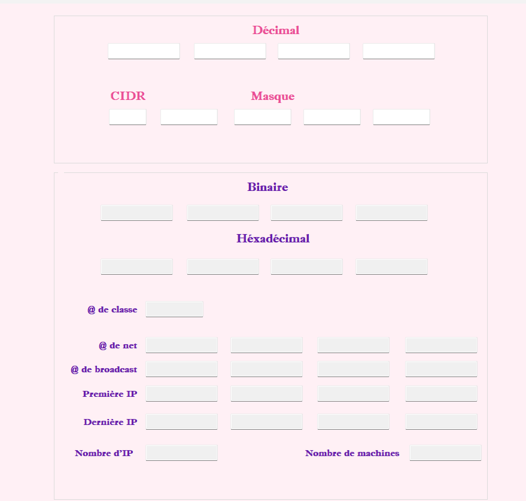
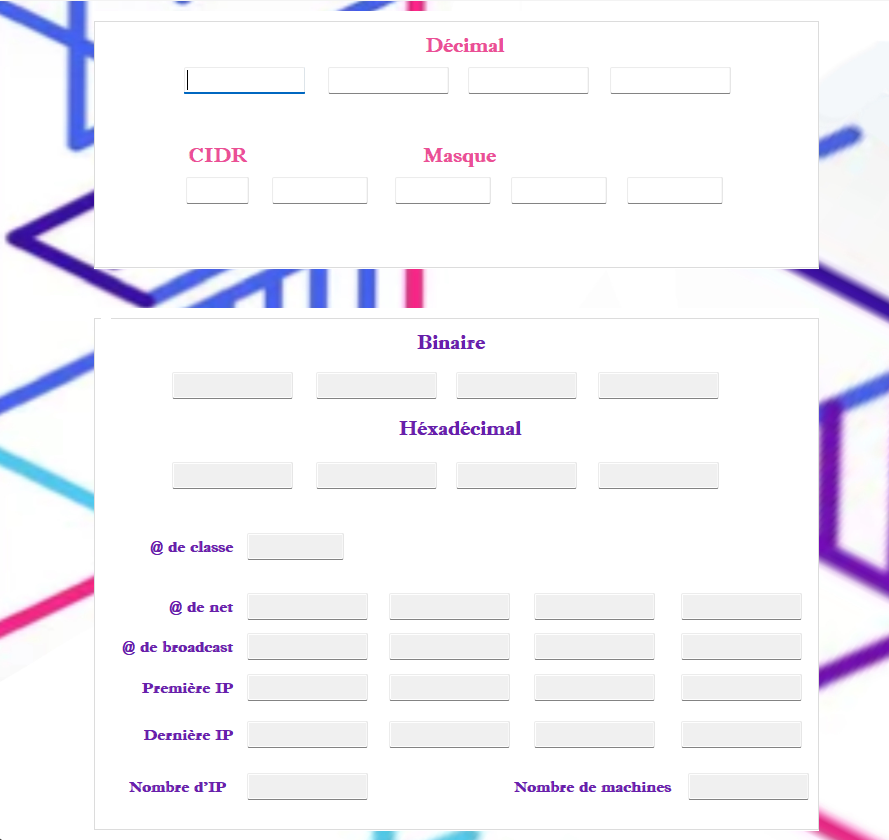
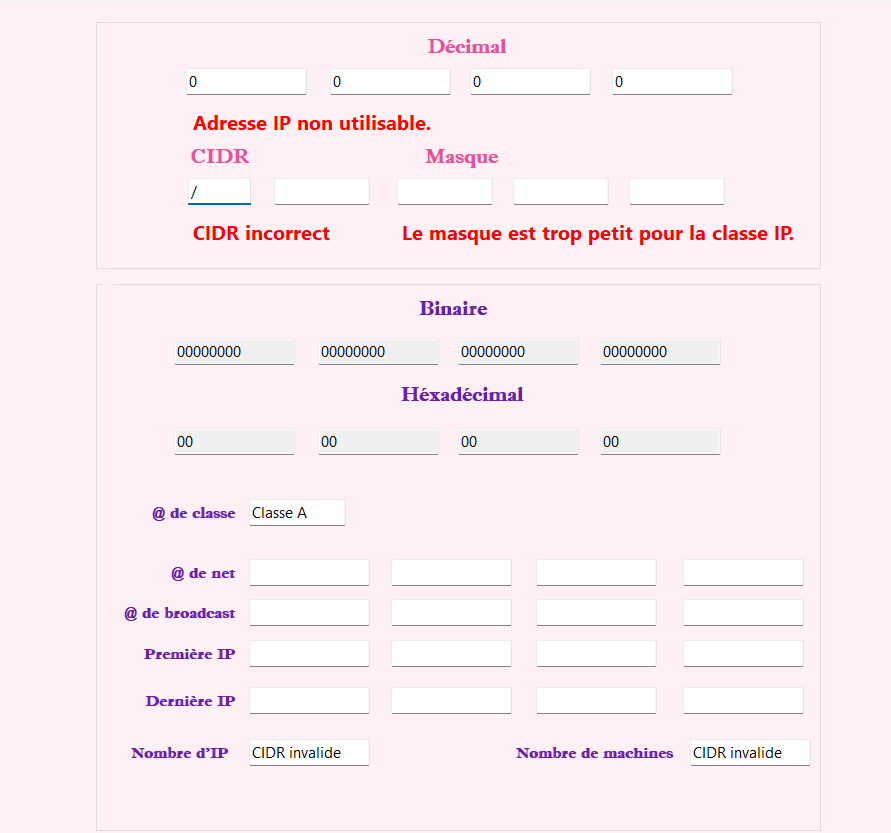

# Calculateur de plage IP (C#)

Projet universitaire développé en C# permettant de calculer les informations réseau à partir d’une adresse IPv4 et d’un masque (CIDR).

## Fonctionnalités

- Calcul de l’adresse réseau (Network)
- Calcul de l’adresse de broadcast
- Détermination de la plage d’hôtes utilisables
- Conversion masque décimal ↔ CIDR
- Validation des entrées utilisateur

## Technologies

- C# (.NET)
- Programmation orientée objet
- Logique de calcul réseau IPv4

## Aperçu

## Notes

Le code source n’est plus disponible. Ce dépôt présente les captures et les éléments visuels du projet.
